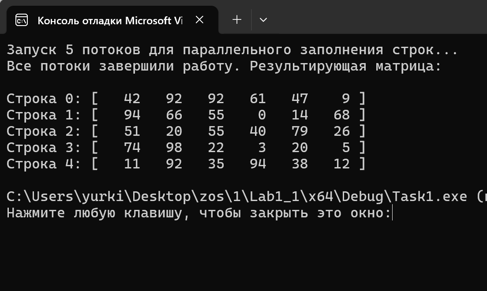
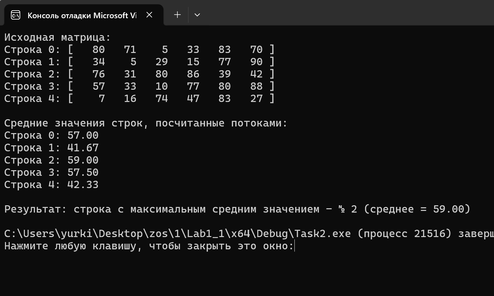
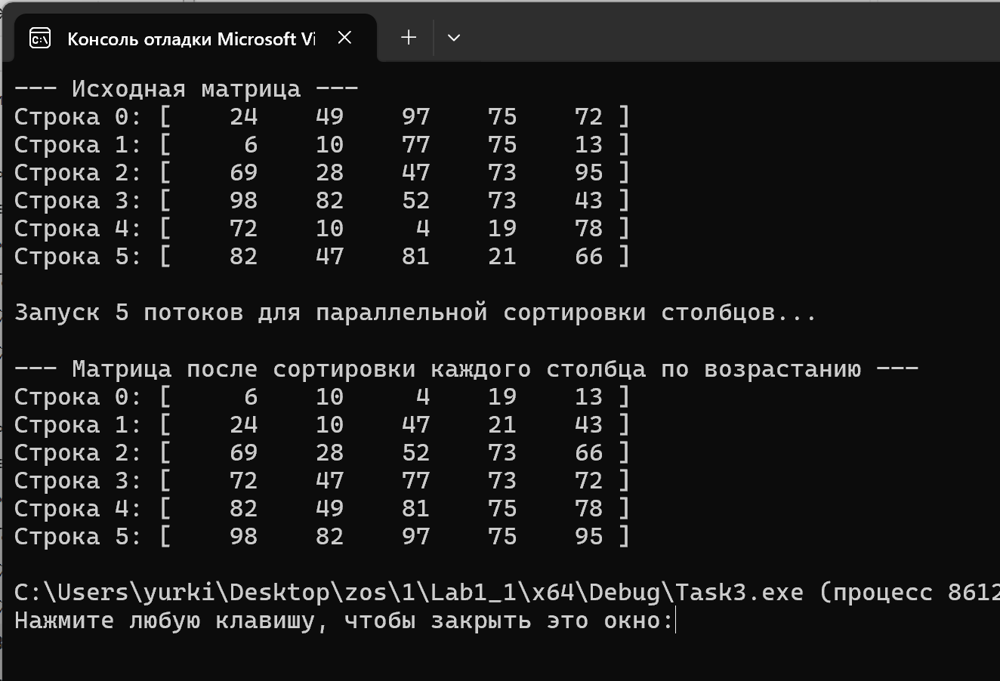
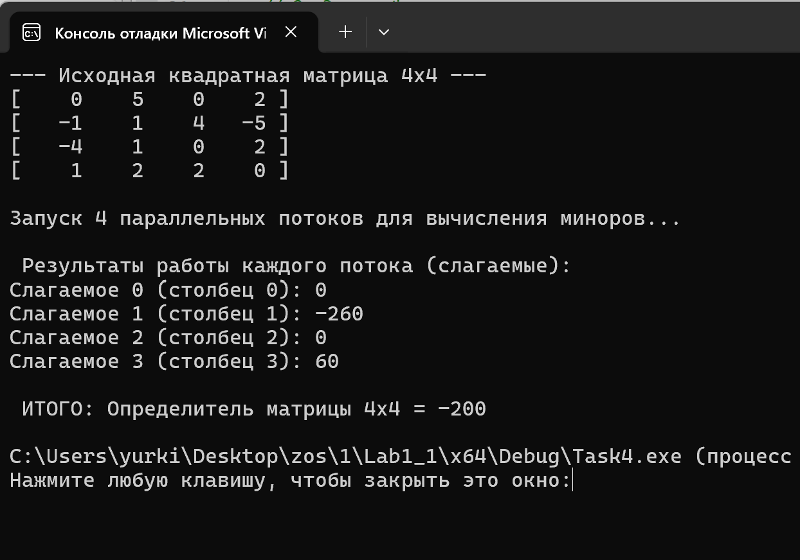
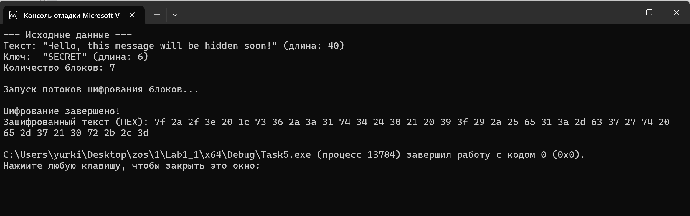
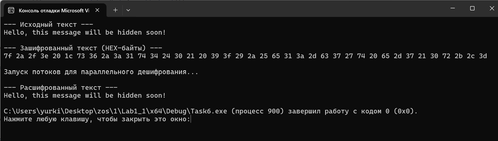
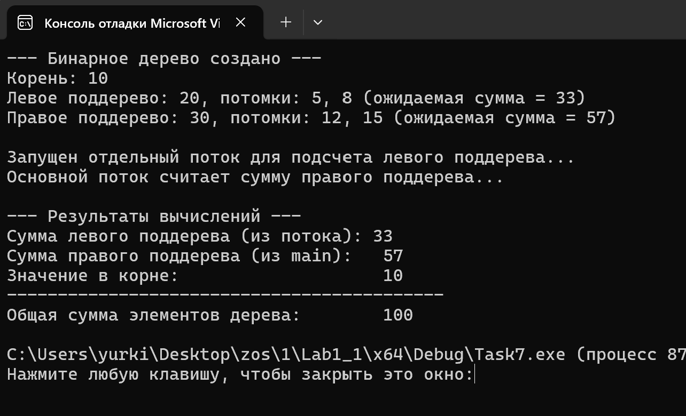

# Операционные системы. Лабораторная работа №1.

---

## Описание заданий и результаты работы

### Задание 1. Параллельное заполнение строк матрицы
* **Постановка задачи:** Изменить приведенный пример так, чтобы создание и заполнение строк матрицы случайными числами происходило параллельно в отдельных потоках.
* **Реализация:** Запускается $m$ потоков (по потоку на строку). Каждый поток инициализирует локальный генератор псевдослучайных чисел и заполняет ячейки своей строки.
* **Результат работы:**

---

### Задание 2. Строка матрицы с максимальным средним значением
* **Постановка задачи:** Найти номер строки матрицы $n \times m$, имеющей максимальное среднее арифметическое значение.
* **Реализация:** Создаются $n$ потоков. Каждый поток вычисляет сумму элементов своей строки, делит её на количество столбцов и записывает результат в массив средних значений. Главный поток после барьера синхронизации находит максимум.
* **Результат работы:**

---

### Задание 3. Параллельная сортировка столбцов методом обмена
* **Постановка задачи:** Отсортировать каждый столбец матрицы по возрастанию методом пузырька (обмена).
* **Реализация:** Запускается $m$ независимых потоков (по числу столбцов). Каждый поток выполняет пузырьковую сортировку элементов только своего столбца.
* **Результат работы:**

---

### Задание 4. Определитель матрицы 4×4
* **Постановка задачи:** Найти определитель квадратной матрицы $4 \times 4$.
* **Реализация:** Использовано разложение Лапласа по элементам первой строки. Запущены 4 параллельных потока, каждый из которых формирует подматрицу $3 \times 3$, рассчитывает её определитель (минор) и соответствующее слагаемое с учетом знака.
* **Результат работы:**

---

### Задание 5. Блочное шифрование текста
* **Постановка задачи:** Разбить текст на блоки длиной $k$ символов. Внутри каждого блока выполнить реверс символов и применить операцию XOR с ключом.
* **Реализация:** Для каждого блока создается поток, принимающий начальное смещение и длину блока. Потоки параллельно трансформируют участки строки.
* **Результат работы:**

---

### Задание 6. Дешифрование текста
* **Постановка задачи:** Восстановить исходный текст по известному ключу шифрования.
* **Реализация:** Операции обращаются в зеркальном порядке: каждый поток для своего блока сначала повторно применяет `XOR` с ключом, а затем возвращает символы на место повторным реверсом блока.
* **Результат работы:**

---

### Задание 7. Сумма элементов бинарного дерева
* **Постановка задачи:** Найти сумму элементов бинарного дерева.
* **Реализация:** Подсчет суммы левого поддерева вынесен в отдельный поток через `CreateThread`, в то время как сумма правого поддерева рассчитывается в основном потоке. Затем результаты объединяются со значением корня.
* **Результат работы:**

